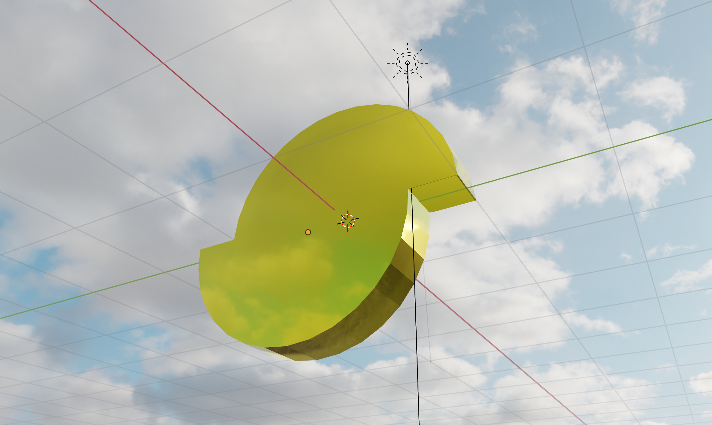
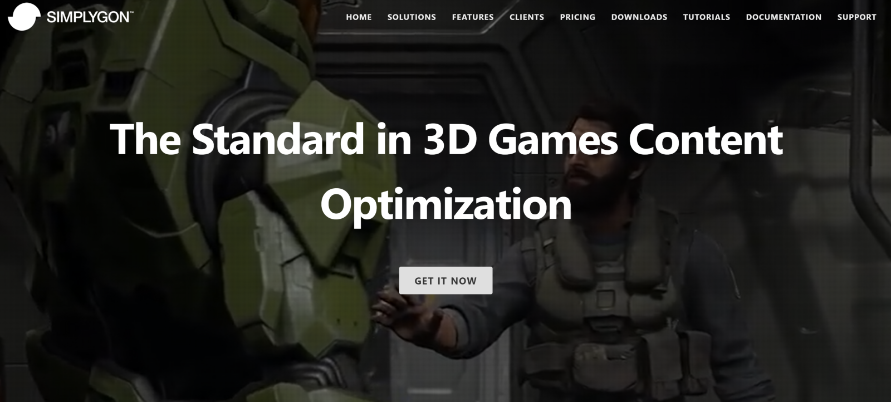
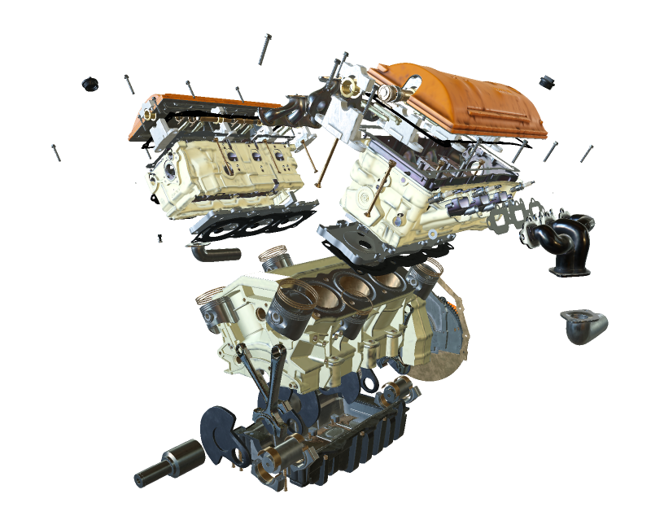
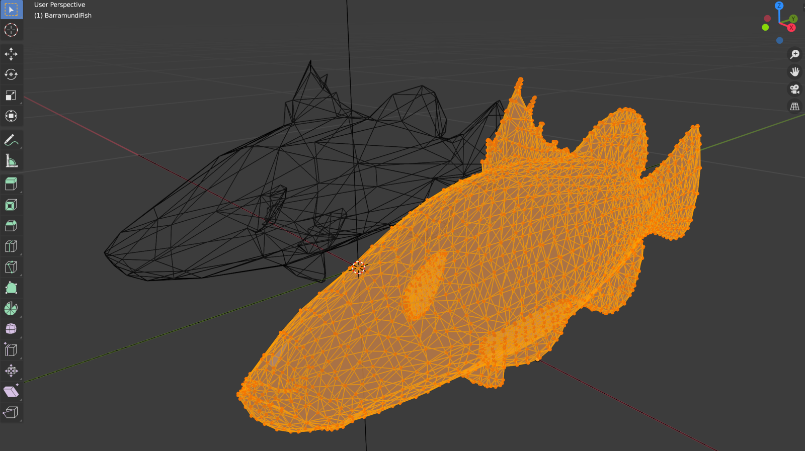
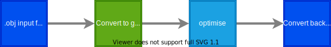
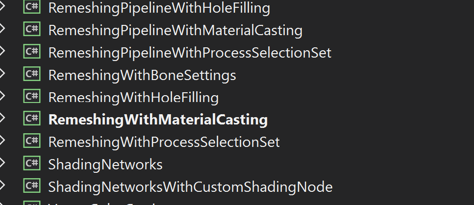
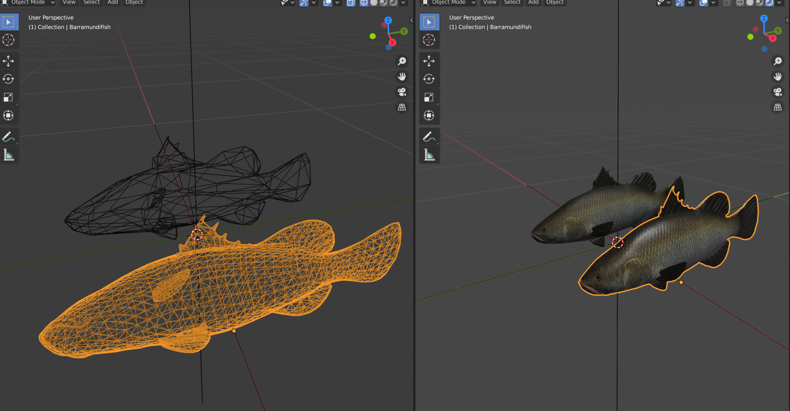
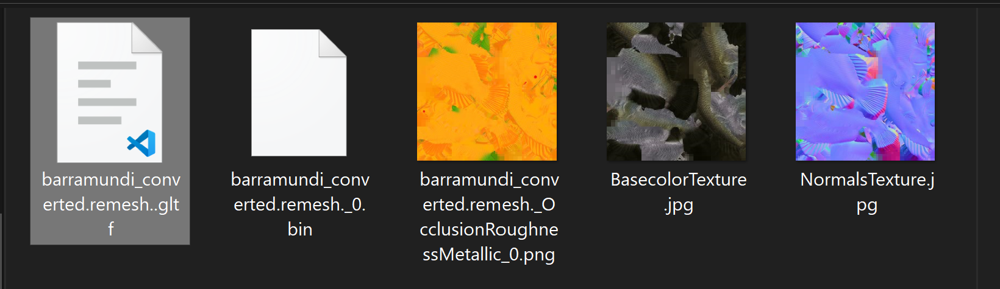

# Simplygon in Azure



I wrote a [previous blog post](http://peted.azurewebsites.net/hololensoptimising-with-simplygon/) about Simplygon a few years ago and the idea of optimising 3D meshes to enable running on a low powered device such as a HoloLens or mobile phone has cropped up on a number of occasions since. The content in the more recent projects have the additional requirement of being loaded into an app dynamically when requested by the app user. Most projects designed to run across these kinds of mobile devices usually need to address the question of whether to render content on a server or locally on the device. Sometimes that choice will be obvious and other times it will be more complicated and represent a trade-off between many competing factors.




## Server Rendering

On one hand if you have large 3D models with dense geometry consisting of millions of triangles where you need to see all of the fine details and the content isn't well suited for optimisation then server-side rendering might be the right choice for you. You might need to account for the infrastructure and maintenance work required to set up a server-side rendering solution and you also will need to understand the costs associated with running cloud services for this kind of a solution. You may need to scale across millions of users or you may only need to spin up and down services at a much smaller scale. If the latter applies then [Azure Remote Rendering](https://azure.microsoft.com/en-gb/services/remote-rendering/) would be a suitable consideration. If the former, then maybe [3D Streaming Toolkit](https://github.com/3DStreamingToolkit/3DStreamingToolkit) or a custom client/server rendering solution might be more cost-effective.



## Client Rendering

On the other hand your original content may consist of very dense geometry; maybe it was created using photogrammetry or using a scanner, but the 3D models and the use case may be suited to geometry and material optimisation. Using techniques such as re-meshing, normal map baking and texture atlases to reduce draw calls in addition to 3D geometry compression can facilitate efficient on-device rendering and also network transmission.



This post will focus on how to fit those techniques into a cloud content pipeline using Simplygon. Often the system would require an 'authoring' step which would allow the content owner to associate metadata and seed 3D model content into a processing pipeline which could run on-premises or in the cloud. So following on from the previous post where we showed how to create a content pipeline on Azure using all of the power of Blender through it's Python scripting interface we'll illustrate how to have an optimisation step within the pipeline. This might look something like this:



We didn't mention the optimise node in there before really but we can make use of the Simplygon SDK to write some code there to provide the model optimisations.

> I focused on the Simplygon desktop application [previously](http://peted.azurewebsites.net/hololensoptimising-with-simplygon/) which is great for testing and proving out scenarios but we're going to need a more automated approach. In addition the Simplygon offering has since moved to version 9 and support for the desktop app is deprecated in favour of improvements to the SDK. The remeshing processor has with more intelligent hole filling & cavity removal and generally better quality results. The SDK is now also available in C# and Python as well as C++.

## Code

We're going to be using C# and we'll run the C# code from within an Azure function similar to how we set up Blender. We won't be using Linux containers this time as the Simplygon SDK has a dependency on Windows.

> You can view all of the code for the Azure Function [here](https://github.com/peted70/az-func-simplygon) where you can also find a **'Deploy to Azure'** button to test this in your own subscription. Note that you would need a Simplygon license key which you would be prompted for after pressing the button.

The Simplygon SDK comes with a suite of examples (see [Simplygon Samples](https://documentation.simplygon.com/SimplygonSDK_9.0.6500.0/api/examples/gettingstarted.html#prerequisites)) for each different language and we're going to follow pretty closely the example of **Remeshing With Material Casting**. I'm just going to look at code used in our sample but for full documentation you can visit [here](https://documentation.simplygon.com/).



We can create an Azure Function in the same way as the previous Blender post and we are going to reuse the code to accept a Uri to a zip archive which contains the 3D model. For details see the [post](http://peted.azurewebsites.net/blender-in-azure/). But instead of calling down into the Blender executable which is installed in the Linux container we are going to call the Simplygon SDK directly.

The samples come with a SimplygonLoader class that verifies the local environment and checks the license. So, the first thing is to make a call to that:

```C#
using (var sg = Simplygon.Loader.InitSimplygon(out var errorCode, out var errorMessage))
{
    if (errorCode != Simplygon.EErrorCodes.NoError)
        return new BadRequestObjectResult($"Failed! {errorCode} - {errorMessage}");

    // Find the first .glTF file in the input and process it.
    var fileToProcess = Directory.GetFiles(zipDir, "*.glTF", SearchOption.AllDirectories)
        .FirstOrDefault();

    remeshedFile = await RunRemeshingWithMaterialCastingAsync(sg, log, fileToProcess, ToOutputPath(outputDir, fileToProcess), data.OnScreenSize);
}
```

The first part of our processing involves **remeshing** which will result in a retopologised geometry rather than one that consists of the original vertices but with some strategic ones removed. The Simplygon [docs](https://documentation.simplygon.com/SimplygonSDK_9.0.6500.0/api/concepts/processors/remeshing.html) provides more details.

The crux of the code requires that we set up a Simplygon scene and we can set the scene on a Simplygon RemeshingProcessor object which we can configure and then run.  

```c#
Simplygon.spScene sgScene = sgSceneImporter.GetScene();

// Create the remeshing processor.
using (Simplygon.spRemeshingProcessor sgRemeshingProcessor = sg.CreateRemeshingProcessor())
{
    sgRemeshingProcessor.SetScene(sgScene);

    using (Simplygon.spRemeshingSettings sgRemeshingSettings = sgRemeshingProcessor.GetRemeshingSettings())
    {
        // Set on-screen size target for remeshing.
        sgRemeshingSettings.SetOnScreenSize(onScreenSize);

    }
    // Start the remeshing process.
    await Task.Run(sgRemeshingProcessor.RunProcessing);
}
```

The second stage of processing involves **material casting** and for us this will result in the input textures being down-rez'd and mapped correctly back onto the retoplogised geometry. Each kind of material channel (e.g. ambient occlusion, normal map, etc.) comes with a different set of input parameters. I'll just include here one of the processing blocks for the metallness channel and you can refer to the [code repo](https://github.com/peted70/az-func-simplygon) for how the other channels are configured:

```c#
string MetalnessTextureFilePath;
using (Simplygon.spColorCaster sgMetalnessCaster = sg.CreateColorCaster())
{
    sgMetalnessCaster.SetMappingImage(sgRemeshingProcessor.GetMappingImage());
    sgMetalnessCaster.SetSourceMaterials(sgScene.GetMaterialTable());
    sgMetalnessCaster.SetSourceTextures(sgScene.GetTextureTable());
    sgMetalnessCaster.SetOutputFilePath("MetalnessTexture");

    using (Simplygon.spColorCasterSettings sgMetalnessCasterSettings = sgMetalnessCaster.GetColorCasterSettings())
    {
        sgMetalnessCasterSettings.SetMaterialChannel("Metalness");
        sgMetalnessCasterSettings.SetOutputImageFileFormat(Simplygon.EImageOutputFormat.JPEG);
    }

    sgMetalnessCaster.RunProcessing();
    MetalnessTextureFilePath = sgMetalnessCaster.GetOutputFilePath();
}
```

When the processing is complete we can zip up the resulting files and return them as a **FileStream**.

```c#
using (var outputZip = new ZipArchive(stream, ZipArchiveMode.Create, true))
{
    outputZip.CreateEntryFromDirectory(outputDir.FullName);
}

stream.Position = 0;

return new FileStreamResult(stream, System.Net.Mime.MediaTypeNames.Application.Zip)
{
    FileDownloadName = "remeshed.zip"
};
```

## Testing

So, we have shown how to build and deploy two example nodes for a 3D content pipeline but in order to test this I currently need to carry out the following:

- Take the model and textures from [here](https://github.com/peted70/az-func-blender/tree/master/TestModels) and add all contents of that folder to a zip archive as it is organized in the folder
- Manually uploaded to blob storage or some other accessible storage
- Used the resulting uri (I generated a SAS uri using the [Azure portal](https://ms.portal.azure.com/) as input to run the Blender Azure Function running either locally or in Azure and download the resulting zip archive (You could use [Postman](https://www.postman.com/) with a POST/GET request or a browser with a GET request)
- Upload that zip archive to blob storage manually (so we can get another uri)
- Use the resulting SAS uri as input to the Simplygon Azure Function running locally on PC or deployed to Azure
- Download and check the resulting zip archive


*Shows the original mesh both shaded and wireframe against the processed result*

And here is the output returned in the zip archive:



## Further Investigation

- Orchestrate the pipeline using either an Azure Logic App or durable function
- Use Blender node to render a resulting simlpified model into an mp4 so it can be easily reviewed
- Investigate network transmission + 3D compression techniques
